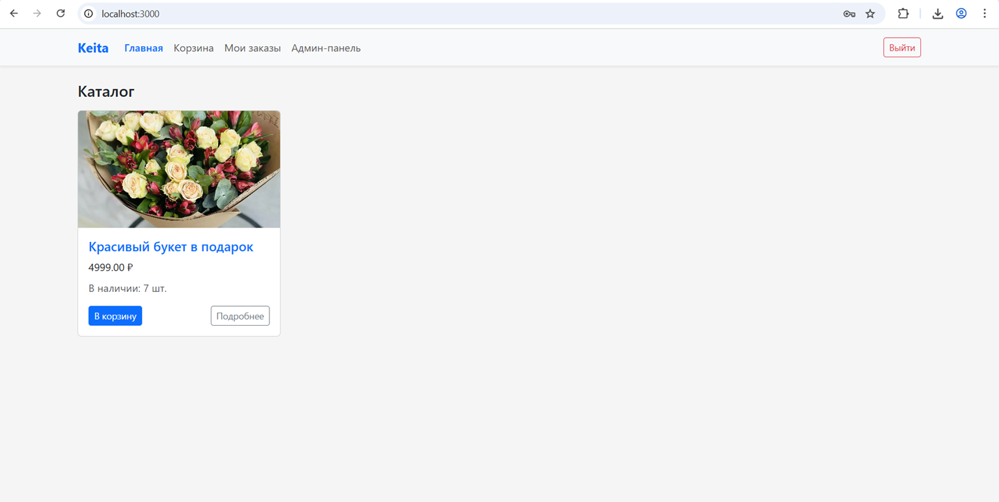

# 🌿 Souvenir Shop — интернет-магазин сувениров  
**Full-Stack проект: React + Spring Boot + PostgreSQL + Docker + Nginx**



---

## 📌 О проекте

**Souvenir Shop** — это полнофункциональный интернет-магазин сувениров с каталогом товаров, корзиной, админ-панелью и загрузкой изображений.  
Проект создан как *портфолионный full-stack кейс* с упором на продакшен-архитектуру:

- раздельные фронтенд и бэкенд,
- Nginx-reverse-proxy для API и изображений,
- сборка и запуск через Docker Compose,
- надёжная логика корзины и управления товарами.

---

## ✨ Основные возможности

### 🛒 Каталог товаров
- фотографии  
- цена, остаток  
- быстрый просмотр  
- детальная карточка товара  

### 🧺 Корзина
- добавление / удаление позиций  
- ограничение по остатку  
- корректный пересчёт количества  

### 🖼 Загрузка фотографий
- загрузка через `multipart/form-data`  
- файлы сохраняются в `/uploads`  
- Nginx отдаёт изображения напрямую (решение проблемы 404 в Docker)

### 🔐 Админ-панель
- авторизация администратора  
- создание / редактирование / удаление товаров  
- загрузка изображений и установка остатков  

### 🏗 Архитектура продакшен-уровня
- React SPA  
- Spring Boot REST API  
- PostgreSQL  
- Nginx reverse proxy  
- Docker Compose  

---

## 🧱 Технологический стек

| Компонент | Технологии |
|----------|------------|
| **Frontend** | React, Axios, React Router |
| **Backend** | Java 21, Spring Boot 3, Spring Data JPA, Spring Security |
| **Database** | PostgreSQL |
| **DevOps** | Docker, Docker Compose, Nginx |
| **Дополнительно** | Lombok, ModelMapper |

---

## 🚀 Запуск проекта через Docker

### Требования:
- Docker  
- Docker Compose  

### Команда запуска:

```bash
git clone https://github.com/keitah/souvenir-shop.git
cd souvenir-shop
docker compose up --build3
```
### После запуска сервисы доступны:
- Сервис	URL
- Фронтенд	http://localhost
- Backend API	http://localhost/api
- PostgreSQL	внутри docker-сети
- Изображения	http://localhost/uploads/...

- Backend по умолчанию поднимается на `http://localhost:8080`.
- Фронт поднимется на `http://localhost:5173`, API по умолчанию `http://localhost:8080/api`.
- PostgreSQL: порт 5432
- Backend: `http://localhost:8080`
- Frontend (Nginx): `http://localhost:3000`

## 📂 Структура проекта
```bash
souvenir-shop/
│
├── backend/                 # Spring Boot приложение
│   ├── src/main/java/
│   ├── src/main/resources/
│   └── Dockerfile
│
├── frontend/                # React SPA
│   ├── src/
│   └── Dockerfile
│
├── uploads/                 # Хранение изображений товаров
│
├── nginx/
│   └── default.conf         # Reverse proxy + отдача статики
│
└── docker-compose.yml
```
## 🔌 Backend API
| Метод    | Путь                 | Описание                 |
| -------- | -------------------- | ------------------------ |
| `GET`    | `/api/products`      | список товаров           |
| `GET`    | `/api/products/{id}` | подробности              |
| `POST`   | `/api/products`      | создать товар *(админ)*  |
| `PUT`    | `/api/products/{id}` | изменить товар *(админ)* |
| `DELETE` | `/api/products/{id}` | удалить товар *(админ)*  |

##Загрузка изображений
```bash
POST /api/products/{id}/image
Content-Type: multipart/form-data
Файл сохраняется как /uploads/<uuid>.png.
```
### Корзина
| Метод  | Путь               | Описание           |
| ------ | ------------------ | ------------------ |
| `GET`  | `/api/cart`        | содержимое корзины |
| `POST` | `/api/cart/add`    | добавление товара  |
| `POST` | `/api/cart/remove` | удаление товара    |

## 🎨 Интерфейс
- современный UI
- адаптивная верстка
- удобная навигация: Главная / Корзина / Мои заказы / Админ
- карточки товаров с фото
- быстрые кнопки действий

## 🔧 Важные технические решения
### 🧱 Отдача изображений через Nginx
Решены проблемы:
- 404 при загрузке картинок внутри Docker
- некорректная отдача из контейнеров React/Backend
Теперь /uploads/** отдаётся напрямую Nginx-ом.

### 🗃 Корректная логика остатков
- невозможно добавить в корзину больше, чем есть
- остатки уменьшаются только при оформлении заказа

### 🔐 Security (базовый)
- админ-панель только для авторизованных пользователей
- возможность расширить на JWT

## 📈 Возможности развития
- Telegram-уведомления администратору
- категории товаров
- избранное
- фильтры и поиск
- роли пользователей (USER / ADMIN)
- аналитика просмотров и заказов

keitah